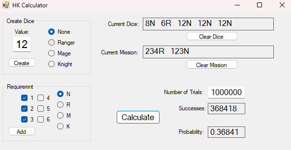

This is a basic dice calculator that will calculate the probability of whether rolling the generated dice once will meet the desired mission.
This was created for a WIP board/dice collecting game.

Create the dice using the menu in the upper left.

Create requirements using the menu in the lower left.

Click the calcuate button to find the probability.

